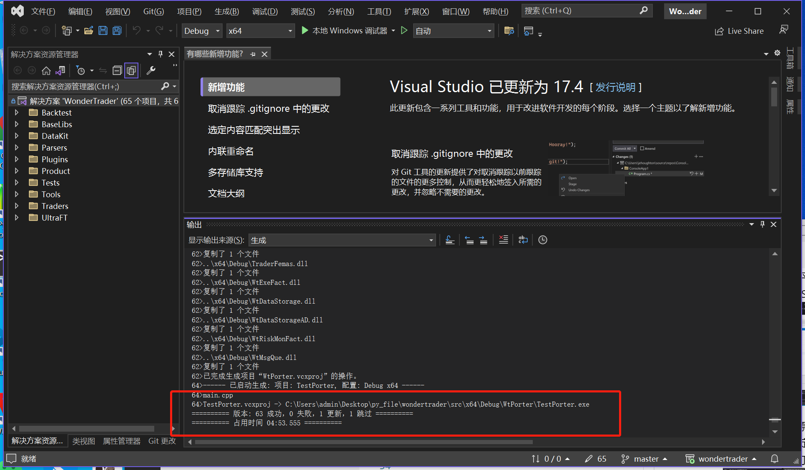

> 前情提示, 如果不想麻烦, 建议使用VS2017和官方推荐环境搭建方式

[WonderTrader官方开发环境搭建](https://wondertrader.github.io/#/devenv)

## 个人自定义环境搭建
1. 下载共享资源资源中的"vc141depends.7z"文件

> 下载连接:https://pan.baidu.com/s/1Bdxh_PgjqHMzuGjl9ernhg
> 
> 提取码: d6bh

2. 将文件解压到"E:/vc141depends"(任意)目录下并将该目录设置为用户环境变量, 变量名为"MyDepends141"

3. 使用git将WonderTrader项目克隆到本地

4. 打开Visual Studio Installer, 安装"MSVCv141"

5. 进入到wondertrader的src目录下, 双击"wondertrader.sln"启动(选择升级不升级无所谓, 后边再改)

6. 按如下步骤, 配置平台工具集(一定选v141)和WindowsSDK版本

7. 回到解决方案资源管理器界面, 右击"解决方案", 选择"重定目标解决方案", 然后按如下配置即可

8. 右击解决方案 -> 生成解决方案, 等待几分钟, 最后出现如下说明编译成功

## 踩坑记
1. 将环境变量写在了系统环境变量中, 导致启动VS之后无法识别. 报错"找不到boosts/..."文件

2. 使用最新的"v143"编译失败