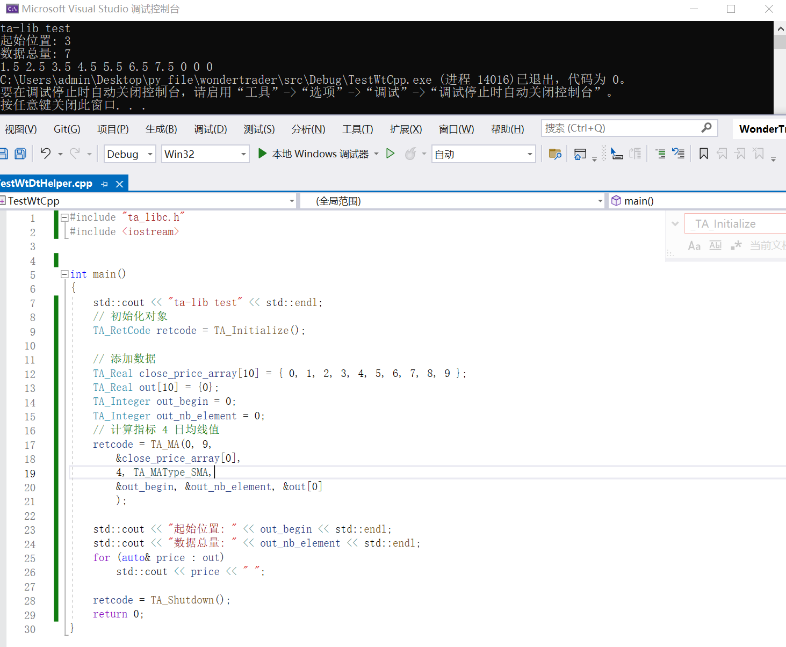

> 前情提示: 
1. TA-Lib是指标计算工具, 本章内容与WonderTrader项目无关
2. "vc141depends"目录是WonderTrader文件依赖目录, 详情看上一章"环境搭建"部分.

## 安装
1. 下载TA-Lib文件: https://ta-lib.org/hdr_dw.html


2. 解压后进入目录: "ta-lib\c\lib", 将以下四个文件复制到"vc141depends\lib\x86"目录下

> ta_abstract_cmr.lib
> ta_common_cmr.lib
> ta_func_cmr.lib
> ta_libc_cmr.lib

3. 将"ta-lib\c\include"下的".h"头文件都复制到"vc141depends\include"

4. 新建win32项目并添加附加依赖项


## 安装测试
#### 测试代码

```cpp
#include "ta_libc.h"
#include <iostream>


int main()
{
	std::cout << "ta-lib test" << std::endl;
	// 初始化对象
	TA_RetCode retcode = TA_Initialize();

	// 添加数据
	TA_Real close_price_array[10] = { 0, 1, 2, 3, 4, 5, 6, 7, 8, 9 };
	TA_Real out[10] = {0};
	TA_Integer out_begin = 0;
	TA_Integer out_nb_element = 0;
	// 计算指标 4 日均线值
	retcode = TA_MA(0, 9,
		&close_price_array[0],
		4, TA_MAType_SMA,
		&out_begin, &out_nb_element, &out[0]
		);

	std::cout << "起始位置: " << out_begin << std::endl;
	std::cout << "数据总量: " << out_nb_element << std::endl;
	for (auto& price : out)
		std::cout << price << " ";

	retcode = TA_Shutdown();
	return 0;
}
```

#### 成功标志


## 踩坑点

- TA-Lib只支持32位程序, 上一张环境搭建部分演示的使用64环境, 需要全部改为32位.