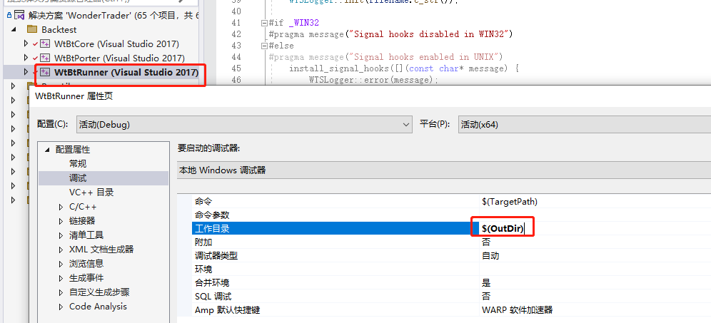
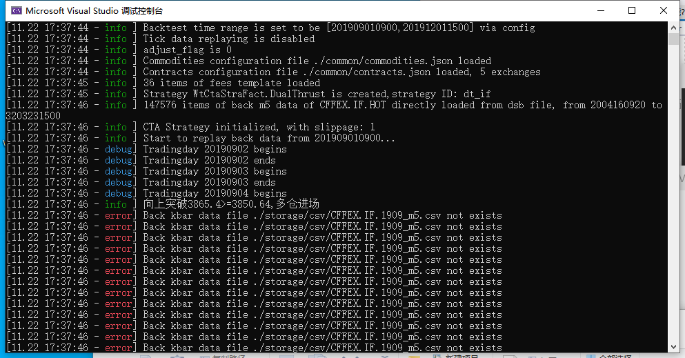

## WT目录介绍
1. demos: 保存了专门编写策略的项目
2. dist: 项目配置文件和数据
3. src: 所有源码
4. src/x64/Debug: 项目编译后输出路径

## CTA回测准备
1. 准备数据
- 将"dist/storage"和"dist/common"文件夹复制到"src/x64/Debug/WtBtRunner/"目录
2. 准备配置文件
- 将"dist/WtBtRunner/"目录下的"configbt.yaml"和"logcfgbt.yaml"复制到"src/x64/Debug/WtBtRunner/"
3. 准备策略文件
- 将"src/x64/Debug/WtCtaStraFact.dll"文件复制到"src/x64/Debug/WtBtRunner/"目录
4. 修改"configbt.yaml"
```yaml
replayer:
    basefiles:
        commodity: ./common/commodities.json
        contract: ./common/contracts.json
        holiday: ./common/holidays.json
        hot: ./common/hots.json
        session: ./common/sessions.json
    fees: ./common/fees.json
    stime: 201909010900         # CTA回测demo开始时间，测试的时候去掉前缀cta_
    etime: 201912011500         # CTA回测demo结束时间，测试的时候去掉前缀cta_
    hft_stime: 202101040900         # HFT回测demo开始时间，测试的时候去掉前缀hft_
    hft_etime: 202101061500         # HFT回测demo结束时间，测试的时候去掉前缀hft_
    uft_stime: 202101040900             # UFT回测demo开始时间，测试的时候去掉前缀uft_
    uft_etime: 202101061500             # UFT回测demo结束时间，测试的时候去掉前缀uft_
    mode: csv
    path: ./storage/
    tick: false                     # 是否开启tick回测，HFT回测时必须开启
env:
    mocker: cta                     # 回测引擎，cta/hft/sel/uft/exec
    slippage: 1
```

## 运行回测
1. 将WtBtRunner项目工作目录修改为$(OutDir), 即: "src/x64/Debug/WtBtRunner/"

2. 右击WtBtRunner将该项目设为启动项目
3. 点击本地Windows调试器运行即可
4. 成功标志(报红是因为缺少数据)


## 调试

按照上述配置运行程序应该不会出现大问题, 如果不小心遗漏了某些步骤导致程序出错, 建议使用VS逐步调试, 查看问题出在哪里