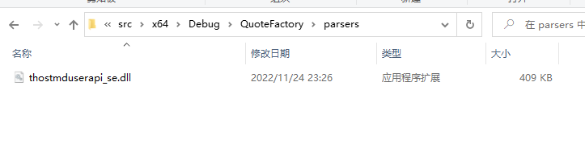
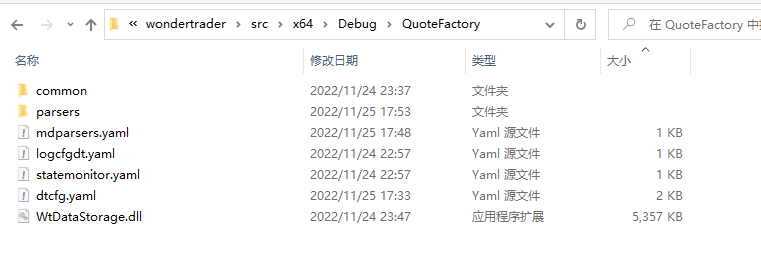
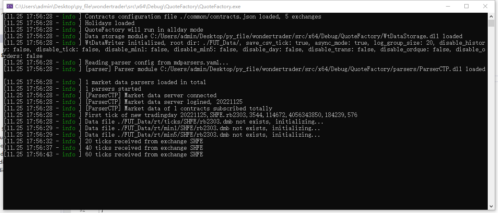

## 前情提示
由于simnow经常崩, 我将使用openctp项目做测试

**[openct项目地址](https://github.com/krenx1983/openctp)**

## 文件准备
1. 工作目录"x64\Debug\QuoteFactory"
2. 下载openctp到本地, 将"openctp/6.3.15_20190220/win64/thostmduserapi_se.dll"(行情dll)文件复制到工作目录下的"parsers"文件夹下
3. 将"wondertrader\src\x64\Debug\WtDataStorage.dll"(数据存储dll)文件复制到工作目录
4. 将"wondertrader\dist\common"文件夹复制到工作目录
5. 将"wondertrader\dist\QuoteFactory"下的几个yaml文件复制到工作目录下

最终我们的文件目录长这样



## 修改配置文件
1. 修改"dtcfg.yaml"文件内容如下

```yaml
basefiles:
    commodity: ./common/commodities.json
    contract: ./common/contracts.json
    holiday: ./common/holidays.json
    session: ./common/sessions.json
    utf-8: true
broadcaster:                    # UDP广播器配置项
    active: true
    bport: 3997                 # UDP查询端口，主要是用于查询最新的快照
    broadcast:                  # 广播配置
    -   host: 255.255.255.255   # 广播地址，255.255.255.255会向整个局域网广播，但是受限于路由器
        port: 9001              # 广播端口，接收端口要和广播端口一致
        type: 2                 # 数据类型，固定为2
allday: true                    # 方便测试, 不启动状态机
parsers: mdparsers.yaml
statemonitor: statemonitor.yaml
writer:
    module: WtDataStorage #数据存储模块
    async: true         #同步落地还是异步落地，期货推荐同步，股票推荐异步
    groupsize: 20       #日志分组大小，主要用于控制日志输出，当订阅合约较多时，推荐1000以上，当订阅的合约数较少时，推荐100以内
    path: ./FUT_Data   #数据存储的路径
    savelog: true      #是否保存log到csv
    disabletick: false    #不保存tick数据，默认false
    disablemin1: false    #不保存min1数据，默认false
    disablemin5: false    #不保存min5数据，默认false
    disableday: false     #不保存day数据，默认false
```

2. 修改"mdparsers.yaml"文件内容如下

```yaml
parsers:
-   active: true
    broker: ''
    front: tcp://121.37.80.177:20004    # 7*24小时地址
    id: parser
    module: ParserCTP
    pass:                   # openctp密码
    user:                   # openctp用户名
    code: SHFE.rb2303       # 订阅合约
```

## 运行程序
1. 将"DataKit/QuoteFactory"项目工作目录修改为$(OutDir)
2. 右击"DataKit/QuoteFactory"将该项目设为启动项目
3. 运行项目中的"main.cpp"
4. 成功标志


## 踩坑点
- mdparsers.yaml中添加的code一定要保证在"common/contracts.json"能找到
