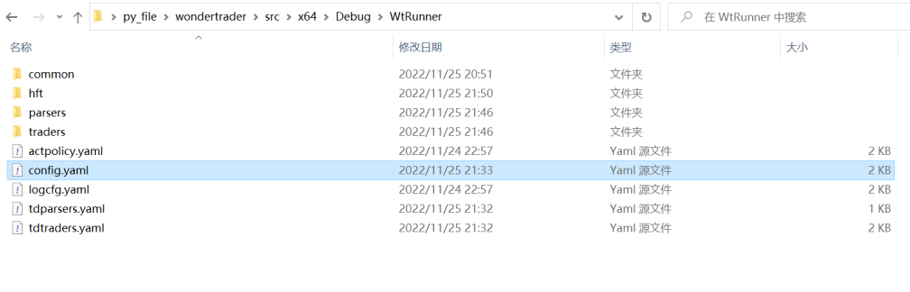
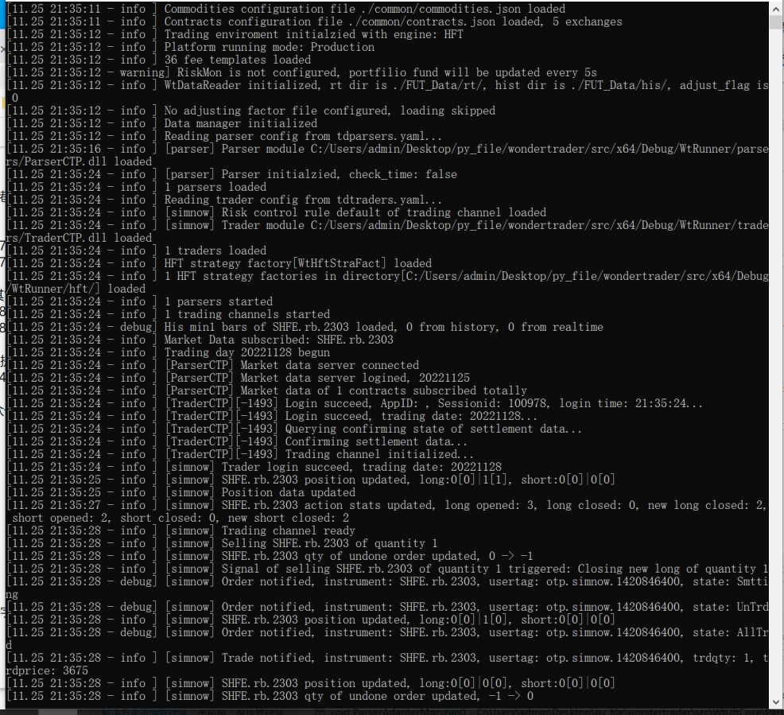

## 前情提示
高频策略引擎，主要针对高频或者低延时策略，事件驱动，系统延迟在1-2微秒之间

HFT是逻辑较简单. 本篇使用openctp项目做测试

**[openct项目地址](https://github.com/krenx1983/openctp)**

## 文件准备
1. 工作目录"x64\Debug\WtRunner"
2. 下载openctp到本地, 将"openctp/6.3.15_20190220/win64/"中的"thostmduserapi_se.dll"(行情dll)文件复制到工作目录下的"parsers/"文件夹下;"thosttraderapi_se.dll"(交易dll)文件复制到工作目录下的"traders/"文件夹下
3. 将"wondertrader\dist\common"文件夹复制到工作目录
4. 将"wondertrader\dist\WtRunnerHft"下的几个yaml文件复制到工作目录下
5. 在工作目录下新建"hft"文件夹, 将"x64\Debug\WtHftStraFact.dll"文件复制到该文件夹下

最终我们的文件目录长这样


## 修改配置文件
1. 我测试的标的是"SHFE.rb.2303", 修改"config.yaml"文件如下

```yaml
#基础配置文件
basefiles:
    commodity: ./common/commodities.json   #品种列表
    contract: ./common/contracts.json      #合约列表
    holiday: ./common/holidays.json        #节假日列表
    hot: ./common/hots.json                #主力合约映射表
    session: ./common/sessions.json        #交易时间模板
    utf-8: false
data:
    store:
        path: ./FUT_Data/      #数据存储根目录
        
strategies:
    hft:
    -   active: true
        id: hft_demo
        name: WtHftStraFact.SimpleHft
        params:
            code: SHFE.rb.2303
            count: 50
            offset: 1
            second: 10
            stock: false
        trader: tts

#环境配置
env:
    name: hft               #引擎名称：cta/hft/sel
    fees: ./common/fees.json   #佣金配置文件
    product:
        session: TRADING    #驱动交易时间模板，TRADING是一个覆盖国内全部交易品种的最大的交易时间模板，从夜盘21点到凌晨1点，再到第二天15:15，详见sessions.json
parsers: tdparsers.yaml     #行情通达配置文件
traders: tdtraders.yaml     #交易通道配置文件
bspolicy: actpolicy.yaml    #开平策略配置文件
```

2. 修改"tdparsers.yaml"文件如下(注意修改用户名和密码)

```yaml
parsers:
-   active: true
    broker: ''
    code: ''
    front: tcp://121.36.146.182:20004
    id: parser
    module: ParserCTP
    user:       # openctp用户名
    pass:       # openctp密码
    localtime: true
    code: SHFE.rb2303
```

3. 修改""文件如下(注意修改用户名和密码)

```yaml
traders:
-   active: true
    id: tts          # id
    module: TraderCTP   # 模块文件名，win下会自动转成xxx.dll，linux会自动转成libxxx.so
    savedata: true      # 是否保存数据，如果为true，会将接口拉取到的成交、订单、资金和持仓都写到本地文件中
    riskmon:            # 通道风控配置
        active: true    # 是否开启
        policy:         # 风控策略
            default:    # 默认策略，也可以针对不同的品种进行风控，格式如CFFEX.IF
                cancel_stat_timespan: 10    # 撤单流控统计时间窗口，单位s
                cancel_times_boundary: 20   # 时间窗口内最大撤单次数，如果超过该次数，撤单指令不会再发送
                cancel_total_limits: 470    # 单日最大撤单笔数（只统计普通撤单，FAK和FOK会忽略掉）
                order_stat_timespan: 10     # 下单流控统计时间窗口，单位s
                order_times_boundary: 20    # 时间窗口内最大下单次数，如果超过该次数，下单指令不会发送
    # 以上是TraderAdapter读取的配置
    # 以下是TraderXXX读取的配置
    front: tcp://121.36.146.182:20002
    broker: ''                      
    appid: 
    authcode: ''    
    user:       # openctp用户名
    pass:       # openctp密码
    quick: true 
```

## 运行程序
1. 将"Product/WtRunner"项目工作目录修改为$(OutDir)
2. 将"Product/WtRunner"项目设为启动项目
3. 运行项目中的"main.cpp"
4. 成功标志


## 踩坑点
- 行情和交易的前置地址忘修改
- common文件夹下的文件默认是gbk格式
- 重点1: config.yaml/env/product/session配置很重要, 一定要选当前时间段能运行的session, 也可以直接修改common/sessions.json文件
- 重点2: 使用openctp测试, 记得修改tdparsers.yaml文件中的配置`localtime: true`