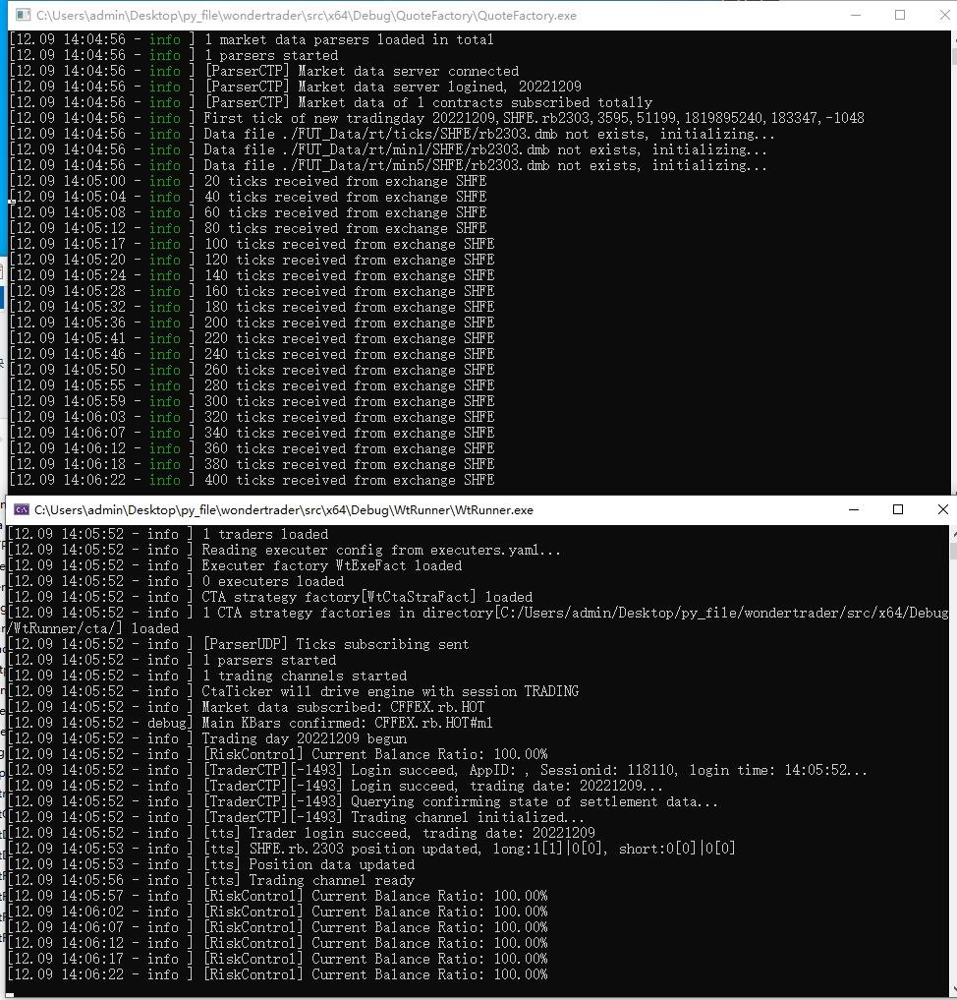

## 前情提示
CTA引擎, 也叫同步策略引擎, 一般适用于标的较少, 计算逻辑较快的策略, 事件+时间驱动. 典型的应用场景包括单标的择时, 中频以下的套利等. Demo中提供的DualThrust策略, 单次重算平均耗时: Python实现版本约70多微秒, C++实现版本约4.5微秒.

进入测试本章节前务必先保证"QuoteFactory"章节运行成功, 本篇使用openctp项目做测试.

**[openct项目地址](https://github.com/krenx1983/openctp)**

## 文件准备
1. 工作目录"x64\Debug\WtRunner"
2. 下载openctp到本地, 将"openctp/6.3.15_20190220/win64/"中的"thostmduserapi_se.dll"(行情dll)文件复制到工作目录下的"parsers/"文件夹下;"thosttraderapi_se.dll"(交易dll)文件复制到工作目录下的"traders/"文件夹下
3. 将"wondertrader\dist\common"文件夹复制到工作目录
4. 将"wondertrader\dist\WtRunnerCta"下的几个yaml文件复制到工作目录下
5. 在工作目录下新建"cta"文件夹, 将"x64\Debug\WtCtaStraFact.dll"文件复制到该文件夹下

## 修改配置文件
1. 我测试的标的是"SHFE.rb.HOT", 修改"config.yaml"文件如下

```yaml
#基础配置文件
basefiles:
    commodity: ./common/commodities.json   #品种列表
    contract: ./common/contracts.json      #合约列表
    holiday: ./common/holidays.json        #节假日列表
    hot: ./common/hots.json                #主力合约映射表
    session: ./common/sessions.json        #交易时间模板
#数据存储
data:
    store:
        path: ./FUT_Data/      #数据存储根目录

#环境配置
env:
    name: cta               #引擎名称：cta/hft/sel
    fees: ./common/fees.json   #佣金配置文件
    filters: filters.yaml       #过滤器配置文件，这个主要是用于盘中不停机干预的
    product:
        session: TRADING    #驱动交易时间模板，TRADING是一个覆盖国内全部交易品种的最大的交易时间模板，从夜盘21点到凌晨1点，再到第二天15:15，详见sessions.json
    riskmon:                #组合风控设置
        active: true            #是否开启
        module: WtRiskMonFact   #风控模块名，会根据平台自动补齐模块前缀和后缀
        name: SimpleRiskMon     #风控策略名，会自动创建对应的风控策略
        #以下为风控指标参数，该风控策略的主要逻辑就是日内和多日的跟踪止损风控，如果回撤超过阈值，则降低仓位
        base_amount: 5000000    #组合基础资金，WonderTrader只记录资金的增量，基础资金是用来模拟组合的基本资金用的，和增量相加得到动态权益
        basic_ratio: 101        #日内高点百分比，即当日最高动态权益是上一次的101%才会触发跟踪侄止损
        calc_span: 5            #计算时间间隔，单位s
        inner_day_active: true  #日内跟踪止损是否启用
        inner_day_fd: 20.0      #日内跟踪止损阈值，即如果收益率从高点回撤20%，则触发风控
        multi_day_active: false #多日跟踪止损是否启用
        multi_day_fd: 60.0      #多日跟踪止损阈值
        risk_scale: 0.3         #风控系数，即组合给执行器的目标仓位，是组合理论仓位的0.3倍，即真实仓位是三成仓
        risk_span: 30           #风控触发时间间隔，单位s。因为风控计算很频繁，如果已经触发风控，不需要每次重算都输出风控日志，加一个时间间隔，友好一些

strategies:
    # CTA策略配置，当mocker为cta时会读取该配置项
    cta:
    -   active: true       # 模块名，linux下为xxxx.so
        id: dt_rb          # 策略ID，自定义的
        name: WtCtaStraFact.DualThrust   # 策略名，要和factory中的匹配
        params:                         # 策略初始化参数，这个根据策略的需要提供
            code: CFFEX.rb.HOT
            count: 50
            days: 30
            k1: 0.6
            k2: 0.6
            period: m1
            stock: false
            

executers: executers.yaml   #执行器配置文件
parsers: tdparsers.yaml     #行情通达配置文件
traders: tdtraders.yaml     #交易通道配置文件
bspolicy: actpolicy.yaml    #开平策略配置文件
```

2. 修改"tdparsers.yaml"文件如下(注意修改用户名和密码)

```yaml
parsers:
-   active: true
    bport: 9001
    filter: ''
    host: 127.0.0.1
    id: parser1
    module: ParserUDP
    sport: 3997
```

3. 修改"tdtraders.yaml"文件如下(注意修改用户名和密码)

```yaml
traders:
-   active: true
    id: trader          # id
    module: TraderCTP   # 模块文件名，win下会自动转成xxx.dll，linux会自动转成libxxx.so
    savedata: true      # 是否保存数据，如果为true，会将接口拉取到的成交、订单、资金和持仓都写到本地文件中
    riskmon:            # 通道风控配置
        active: true    # 是否开启
        policy:         # 风控策略
            default:    # 默认策略，也可以针对不同的品种进行风控，格式如CFFEX.IF
                cancel_stat_timespan: 10    # 撤单流控统计时间窗口，单位s
                cancel_times_boundary: 20   # 时间窗口内最大撤单次数，如果超过该次数，撤单指令不会再发送
                cancel_total_limits: 470    # 单日最大撤单笔数（只统计普通撤单，FAK和FOK会忽略掉）
                order_stat_timespan: 10     # 下单流控统计时间窗口，单位s
                order_times_boundary: 20    # 时间窗口内最大下单次数，如果超过该次数，下单指令不会发送
    # 以上是TraderAdapter读取的配置
    # 以下是TraderXXX读取的配置
    front: tcp://121.36.146.182:20002
    broker: ''                      
    appid: 
    authcode: ''    
    user:       # openctp用户名
    pass:       # openctp密码
    quick: true                       # 是否订阅快速私有流，如果为true，则不会接受上次之前的私有流，这个一定要为true！！！
    # ctpmodule: thosttraderapi_se    # ctp模块名，如果需要使用其他仿制CTP模块，使用该配置项直接将仿制的CTP模块传给TraderCTP即可
    # flowdir: CTPTDFlow              # 数据流存储目录，可不填，也可以自己定义
```

## 运行程序
1. 将"Product/WtRunner"项目工作目录修改为$(OutDir)
2. 将"Product/WtRunner"项目设为启动项目
3. 启动"QuoteFactory"文件夹中的"QuoteFactory.exe"
4. 运行项目中的"main.cpp"
5. 成功标志


## 踩坑点
- CTP引擎配置使用UDP转发行情数据, 因此需要先启动"QuoteFactory.exe"