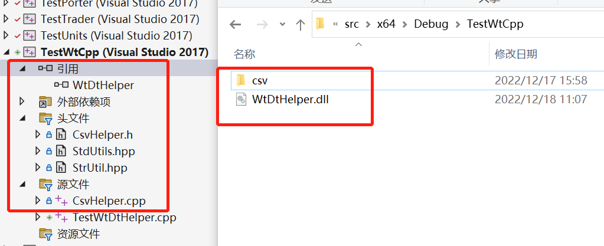
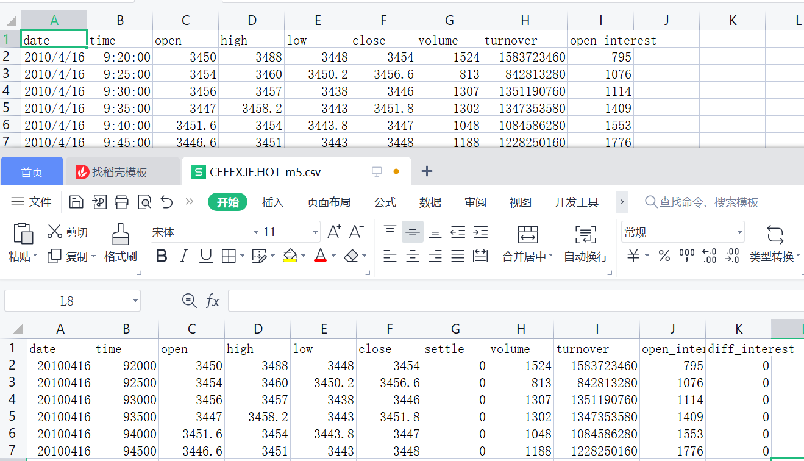

## 环境准备
1. 右击TestWtCpp属性 -> C/C++ -> 预处理器 -> 预处理器定义, 添加"_CRT_SECURE_NO_WARNINGS"
2. 右击添加引用"WtDtHelper"
3. 右击添加头文件: "CsvHelper.h", "StdUtils.hpp", "StrUtil.hpp"
4. 右击添加源文件"CsvHelper.cpp"
5. 将"dist/storage/csv/CFFEX.IF.HOT_m5.csv"放入"src/x64/Debug/TestWtCpp/csv"目录下
6. 将"src/x64/Debug/WtDtPorter/WtDtHelper.dll"文件拷贝到"src/x64/Debug/TestWtCpp"目录下

最终我们的文件如下


## 主文件
在"TestWtDtHelper.cpp"文件中写入如下内容

```cpp
#include "../Share/StrUtil.hpp"
#include "../Share/TimeUtils.hpp"
#include "../Share/BoostFile.hpp"
#include "../WTSTools/CsvHelper.h"
#include "../Includes/WTSStruct.h"
#include "../WtDtHelper/WtDtHelper.h"


// 回调日志输出
void on_log(const char* message)
{
	printf(message);
	printf("\r\n");
}

uint32_t strToTime(const char* strTime, bool bKeepSec = false)
{
	std::string str;
	const char* pos = strTime;
	while (strlen(pos) > 0)
	{
		if (pos[0] != ':')
		{
			str.append(pos, 1);
		}
		pos++;
	}

	uint32_t ret = strtoul(str.c_str(), NULL, 10);
	if (ret > 10000 && !bKeepSec)
		ret /= 100;

	return ret;
}

uint32_t strToDate(const char* strDate)
{
	StringVector ay = StrUtil::split(strDate, "/");
	if (ay.size() == 1)
		ay = StrUtil::split(strDate, "-");
	std::stringstream ss;
	if (ay.size() > 1)
	{
		auto pos = ay[2].find(" ");
		if (pos != std::string::npos)
			ay[2] = ay[2].substr(0, pos);
		ss << ay[0] << (ay[1].size() == 1 ? "0" : "") << ay[1] << (ay[2].size() == 1 ? "0" : "") << ay[2];
	}
	else
		ss << ay[0];

	return strtoul(ss.str().c_str(), NULL, 10);
}


void csv_to_bars(WtString csvFolder, WtString binFolder, WtString period, FuncLogCallback cbLogger /* = NULL */)
{
	// 1. 判断目录
	if (!BoostFile::exists(csvFolder))
		return;

	if (!BoostFile::exists(binFolder))
		BoostFile::create_directories(binFolder);
	// 2. 判断数据周期
	WTSKlinePeriod kp = KP_DAY;
	if (wt_stricmp(period, "m1") == 0)
		kp = KP_Minute1;
	else if (wt_stricmp(period, "m5") == 0)
		kp = KP_Minute5;
	else
		kp = KP_DAY;
	
	CsvReader reader(",");

	// 3. 遍历目录下的csv文件
	boost::filesystem::path myPath(csvFolder);
	boost::filesystem::directory_iterator endIter;
	for (boost::filesystem::directory_iterator iter(myPath); iter != endIter; iter++)
	{
		if (boost::filesystem::is_directory(iter->path()))
			continue;

		if (iter->path().extension() != ".csv")
			continue;

		const std::string& path = iter->path().string();

		if (cbLogger)
			cbLogger(StrUtil::printf("正在读取数据文件%s...", path.c_str()).c_str());

		
		if (!reader.load_from_file(path.c_str()))
		{
			if (cbLogger)
				cbLogger(StrUtil::printf("读取数据文件%s失败...", path.c_str()).c_str());
			continue;
		}

		std::vector<WTSBarStruct> bars;
		while (reader.next_row())
		{
			//逐行读取
			WTSBarStruct bs;
			bs.date = strToDate(reader.get_string("date"));
			if (kp != KP_DAY)
				bs.time = TimeUtils::timeToMinBar(bs.date, strToTime(reader.get_string("time")));
			bs.open = reader.get_double("open");
			bs.high = reader.get_double("high");
			bs.low = reader.get_double("low");
			bs.close = reader.get_double("close");
			// bs.settle = reader.get_double("settle");
			bs.vol = reader.get_uint32("volume");
			bs.money = reader.get_double("turnover");
			bs.hold = reader.get_uint32("open_interest");
			// bs.add = reader.get_int32("add");

			bars.emplace_back(bs);

			if (bars.size() % 1000 == 0)
			{
				if (cbLogger)
					cbLogger(StrUtil::printf("已读取数据%u条", bars.size()).c_str());
			}
		}
		if (cbLogger)
			cbLogger(StrUtil::printf("数据文件%s全部读取完成,共%u条", path.c_str(), bars.size()).c_str());

		// 保存文件名
		std::string filename = StrUtil::standardisePath(binFolder);
		filename += iter->path().stem().string();
		filename += ".dsb";

		// 保存数据
		store_bars(filename.c_str(), bars.data(), bars.size(), period, on_log);
	}
}

int main()
{
	// csv转dsb
	csv_to_bars("csv", "bin", "m5", on_log);
	// dsb转csv
	dump_bars("bin", "csv_out");

	return 0;
}
```

1. 执行上述文件后, 便可以看到bin目录下出现的csv转成的dsb文件
2. csv_out目录是从dsb转成csv的文件
3. 成功验证
打开csv目录下文件和csv_out目录下文件, 二者数据一致, 即说明数据转换成功
