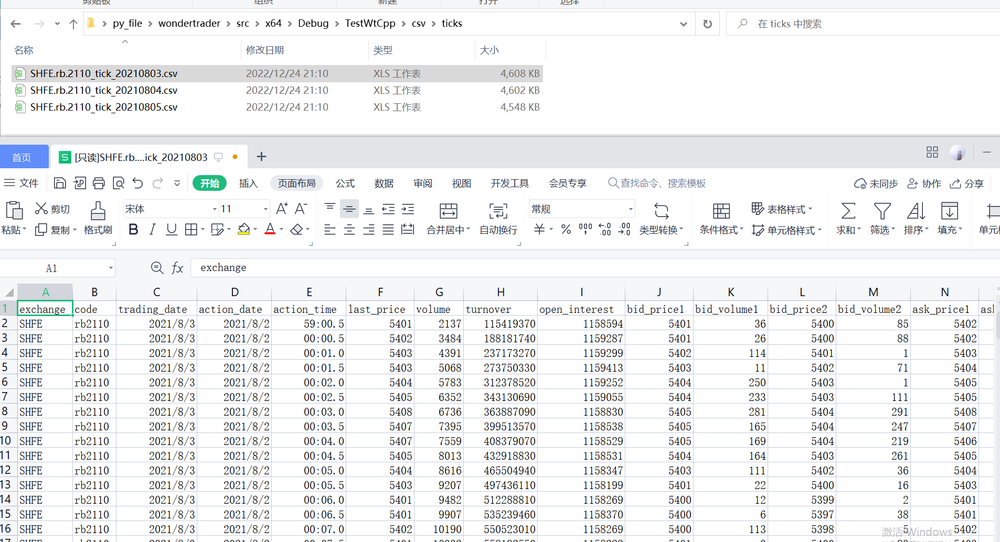

## 环境准备
1. 和Bar数据转换一致
2. 自己准备tick数据, 按日存放在"csv/ticks/"目录下

比如


## 主文件
在"TestWtDtHelper.cpp"文件中写入如下内容

```cpp
#include "../Share/StrUtil.hpp"
#include "../Share/TimeUtils.hpp"
#include "../Share/BoostFile.hpp"
#include "../WTSTools/CsvHelper.h"
#include "../Includes/WTSStruct.h"
#include "../WtDtHelper/WtDtHelper.h"


// 回调日志输出
void on_log(const char* message)
{
	printf(message);
	printf("\r\n");
}

uint32_t strToTime(const char* strTime, bool bKeepSec = false)
{
	std::string str;
	const char* pos = strTime;
	while (strlen(pos) > 0)
	{
		if (pos[0] != ':')
		{
			str.append(pos, 1);
		}
		pos++;
	}

	uint32_t ret = strtoul(str.c_str(), NULL, 10);
	if (ret > 10000 && !bKeepSec)
		ret /= 100;

	return ret;
}

uint32_t strToDate(const char* strDate)
{
	StringVector ay = StrUtil::split(strDate, "/");
	if (ay.size() == 1)
		ay = StrUtil::split(strDate, "-");
	std::stringstream ss;
	if (ay.size() > 1)
	{
		auto pos = ay[2].find(" ");
		if (pos != std::string::npos)
			ay[2] = ay[2].substr(0, pos);
		ss << ay[0] << (ay[1].size() == 1 ? "0" : "") << ay[1] << (ay[2].size() == 1 ? "0" : "") << ay[2];
	}
	else
		ss << ay[0];

	return strtoul(ss.str().c_str(), NULL, 10);
}


// 将毫秒时间转数值时间
uint32_t strToMsTime(const char* strTime)
{
	std::string str;
	const char* pos = strTime;
	while (strlen(pos) > 0)
	{
		if (pos[0] != ':')
		{
			str.append(pos, 1);
		}
		pos++;
	}

	uint32_t ret = atof(str.c_str()) * 1000;

	return ret;
}

void csv_to_ticks(WtString tickFolder, WtString binFolder, FuncLogCallback cbLogger /* = NULL */)
{
	// 1. 判断目录
	if (!BoostFile::exists(tickFolder))
		return;

	if (!BoostFile::exists(binFolder))
		BoostFile::create_directories(binFolder);

	// 2. 遍历目录下的csv文件
	boost::filesystem::path myPath(tickFolder);
	boost::filesystem::directory_iterator endIter;
	for (boost::filesystem::directory_iterator iter(myPath); iter != endIter; iter++)
	{
		if (boost::filesystem::is_directory(iter->path()))
			continue;

		if (iter->path().extension() != ".csv")
			continue;

		const std::string& path = iter->path().string();

		if (cbLogger)
			cbLogger(StrUtil::printf("正在读取数据文件%s...", path.c_str()).c_str());

		CsvReader reader(",");
		if (!reader.load_from_file(path.c_str()))
		{
			if (cbLogger)
				cbLogger(StrUtil::printf("读取数据文件%s失败...", path.c_str()).c_str());
			continue;
		}

		std::vector<WTSTickStruct> ticks;
		while (reader.next_row())
		{
			//逐行读取
			WTSTickStruct ts;
			strcpy(ts.exchg, reader.get_string("exchange"));
			strcpy(ts.code, reader.get_string("code"));
			ts.price = reader.get_double("last_price");
			ts.open = reader.get_double("open");
			ts.high = reader.get_double("high");
			ts.low = reader.get_double("low");
			ts.settle_price = reader.get_double("settle_price");
			ts.upper_limit = reader.get_double("upper_limit");
			ts.upper_limit = reader.get_double("lower_limit");

			ts.total_volume = reader.get_uint32("total_volume");
			ts.volume = reader.get_uint32("volume");

			ts.total_turnover = reader.get_double("total_turnover");
			ts.turn_over = reader.get_double("turnover");
			ts.open_interest = reader.get_uint32("open_interest");
			ts.diff_interest = reader.get_int32("diff_interest");

			// 日期和时间(毫秒)注意要计算变形
			ts.trading_date = strToDate(reader.get_string("trading_date"));
			ts.action_date = strToDate(reader.get_string("action_date"));
			// 自定义了一个计算毫秒时间的函数
			ts.action_time = strToMsTime(reader.get_string("action_time"));

			ts.pre_close = reader.get_double("pre_close");
			ts.pre_settle = reader.get_double("pre_settle");
			ts.pre_interest = reader.get_int32("pre_interest");

			ts.bid_prices[0] = reader.get_double("bid_price1");
			ts.ask_prices[0] = reader.get_double("ask_price1");
			ts.bid_qty[0] = reader.get_uint32("bid_volume1");
			ts.ask_qty[0] = reader.get_uint32("ask_volume1");

			ts.bid_prices[1] = reader.get_double("bid_price2");
			ts.ask_prices[1] = reader.get_double("ask_price2");
			ts.bid_qty[1] = reader.get_uint32("bid_volume2");
			ts.ask_qty[1] = reader.get_uint32("ask_volume2");

			ticks.emplace_back(ts);

			if (ticks.size() % 6000 == 0)
			{
				if (cbLogger)
					cbLogger(StrUtil::printf("已读取数据%u条", ticks.size()).c_str());
			}
		}
		if (cbLogger)
			cbLogger(StrUtil::printf("数据文件%s全部读取完成,共%u条", path.c_str(), ticks.size()).c_str());

		// 保存文件名
		std::string filename = StrUtil::standardisePath(binFolder);
		filename += iter->path().stem().string();
		filename += ".dsb";

		// 保存数据
		store_ticks(filename.c_str(), ticks.data(), ticks.size(), on_log);
	}
}

int main()
{
	// csv转dsb
	csv_to_ticks("csv/ticks", "bin/ticks", on_log);
	// dsb转csv
	dump_ticks("bin/ticks", "csv_out");

	return 0;
}
```

1. 执行上述文件后, 便可以看到bin目录下出现的csv转成的dsb文件
2. csv_out目录是从dsb转成csv的文件
3. 成功验证
打开csv目录下文件和csv_out目录下文件, 二者数据一致, 即说明数据转换成功