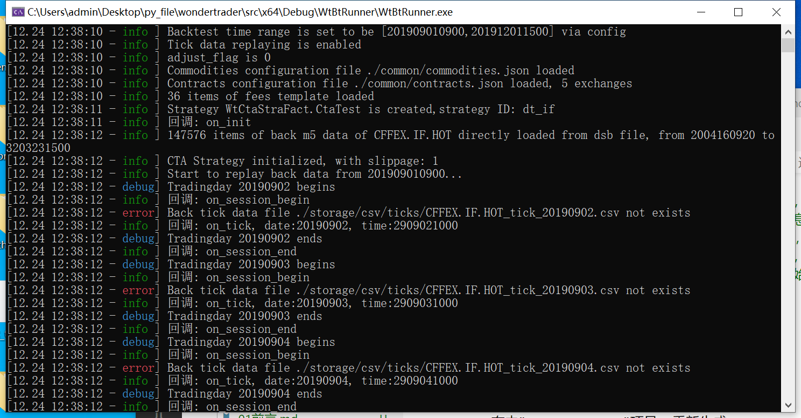

## 环境准备
1. 在"Plugins/WtCtaStraFact/DualThrust"下新建文件"WtStraCtaTest.h"和"WtStraCtaTest.cpp", 编写自己的策略逻辑, (示例源码见后文).

#### WtStraCtaTest.h
```cpp
#pragma once
#include "../Includes/CtaStrategyDefs.h"

class WtStraCtaTest : public CtaStrategy
{
public:
	WtStraCtaTest(const char* id);
	virtual ~WtStraCtaTest();

public:
	// 执行单元名称
	virtual const char* getName() override;
	// 所属执行器工厂名称
	virtual const char* getFactName() override;
	// 初始化
	virtual bool init(WTSVariant* cfg) override;
	// 初始化回调
	virtual void on_init(ICtaStraCtx* ctx) override;
	// 交易日开始
	virtual void on_session_begin(ICtaStraCtx* ctx, uint32_t uTDate) override;
	// 交易日结束
	virtual void on_session_end(ICtaStraCtx* ctx, uint32_t uTDate) override;
	// 主体逻辑执行入口
	virtual void on_schedule(ICtaStraCtx* ctx, uint32_t uDate, uint32_t uTime) override;
	// 主体逻辑执行完成
	virtual void on_schedule_done(ICtaStraCtx* ctx, uint32_t uDate, uint32_t uTime) override;
	// tick数据
	virtual void on_tick(ICtaStraCtx* ctx, const char* stdCode, WTSTickData* newTick) override;
	// K线闭合
	virtual void on_bar(ICtaStraCtx* ctx, const char* stdCode, const char* period, WTSBarStruct* newBar) override;

private:
	// 保存主力合约代码
	std::string _moncode;

	//数据周期
	std::string _period;
	//K线条数
	uint32_t	_count;
	//合约代码
	std::string _code;
	bool		_isstk;
};
```

#### WtStraCtaTest.cpp
```cpp
#include "WtStraCtaTest.h"
#include "../Share/fmtlib.h"
#include "../Includes/ICtaStraCtx.h"
#include "../Includes/WTSVariant.hpp"
#include "../Includes/WTSDataDef.hpp"
#include "../Share/decimal.h"

extern const char* FACT_NAME;

WtStraCtaTest::WtStraCtaTest(const char* id):
	CtaStrategy(id)
{}
WtStraCtaTest::~WtStraCtaTest()
{
}
const char* WtStraCtaTest::getName()
{
	return "CtaTest";
}
const char* WtStraCtaTest::getFactName()
{
	return FACT_NAME;
}
bool WtStraCtaTest::init(WTSVariant* cfg)
{
	if (cfg == NULL)
		return false;
	// 从配置文件中获取参数
	_period = cfg->getCString("period");	// 策略周期
	_count = cfg->getUInt32("count");		
	_code = cfg->getCString("code");		// 交易品种
	_isstk = cfg->getBoolean("stock");		// 是否股票
	return false;
}

void WtStraCtaTest::on_init(ICtaStraCtx* ctx)
{
	ctx->stra_log_info(fmt::format("回调: on_init ").c_str());

	std::string code = _code;
	ctx->stra_sub_ticks(_code.c_str());
	WTSKlineSlice* kline = ctx->stra_get_bars(code.c_str(), _period.c_str(), _count, true);
	if (kline == NULL)
	{
		ctx->stra_log_info(fmt::format("on_init 没有K线数据").c_str());
		return;
	}

	kline->release();
}

void WtStraCtaTest::on_session_begin(ICtaStraCtx* ctx, uint32_t uTDate)
{
	ctx->stra_log_info(fmt::format("回调: on_session_begin").c_str());

	std::string newMonCode = ctx->stra_get_rawcode(_code.c_str());
	if (newMonCode != _moncode)
	{
		if (!_moncode.empty())
		{
			double curPos = ctx->stra_get_position(_moncode.c_str());
			if (!decimal::eq(curPos, 0))
			{
				ctx->stra_log_info(fmt::format("主力换月,  老主力{}[{}]将会被清理", _moncode, curPos).c_str());
				ctx->stra_set_position(_moncode.c_str(), 0, "switchout");
				ctx->stra_set_position(newMonCode.c_str(), curPos, "switchin");
			}
		}
		_moncode = newMonCode;
	}
}

void WtStraCtaTest::on_session_end(ICtaStraCtx* ctx, uint32_t uTDate)
{
	ctx->stra_log_info(fmt::format("回调: on_session_end").c_str());
}

void WtStraCtaTest::on_schedule(ICtaStraCtx* ctx, uint32_t uDate, uint32_t uTime)
{
	ctx->stra_log_info(fmt::format("回调: on_schedule").c_str());

	std::string code = _code;
	WTSKlineSlice* kline = ctx->stra_get_bars(code.c_str(), _period.c_str(), _count, true);
	if (kline == NULL)
	{
		ctx->stra_log_info(fmt::format("on_schedule 没有K线数据").c_str());
		return;
	}
	if (kline->size() == 0)
	{
		kline->release();
		return;
	}
	uint32_t trdUnit = 1;
	if (_isstk)
		trdUnit = 100;

	double openPx = kline->at(-1)->open;
	ctx->stra_log_info(fmt::format("K线open: {}", openPx).c_str());
	//这个释放一定要做
	kline->release();
}

void WtStraCtaTest::on_schedule_done(ICtaStraCtx* ctx, uint32_t uDate, uint32_t uTime)
{
	ctx->stra_log_info(fmt::format("回调: on_schedule_done").c_str());
}

void WtStraCtaTest::on_tick(ICtaStraCtx* ctx, const char* stdCode, WTSTickData* newTick)
{
	WTSKlineSlice* kline = ctx->stra_get_bars(_code.c_str(), _period.c_str(), _count, true);
	uint32_t _date = kline->at(-1)->date;
	uint64_t _time = kline->at(-1)->time;
	if (_time % 1000 == 0)
	{
		ctx->stra_log_info(fmt::format("回调: on_tick, date:{}, time:{}", _date, _time).c_str());
	}
}

void WtStraCtaTest::on_bar(ICtaStraCtx* ctx, const char* stdCode, const char* period, WTSBarStruct* newBar)
{
	ctx->stra_log_info(fmt::format("回调: on_bar").c_str());
}
```

## 文件修改
1. 修改"WtCtaStraFact.cpp"文件中的`createStrategy`函数
```cpp
#include "WtStraCtaTest.h"

CtaStrategy* WtStraFact::createStrategy(const char* name, const char* id)
{
	if (strcmp(name, "DualThrust") == 0)
		return new WtStraDualThrust(id);
	else if(strcmp(name, "CtaTest") == 0)
		return new WtStraCtaTest(id);
	return NULL;
}
```
2. 新建"src/x64/Debug/WtBtRunner/configbt.yaml"文件内容如下
```yaml
replayer:
    basefiles:
        commodity: ./common/commodities.json
        contract: ./common/contracts.json
        holiday: ./common/holidays.json
        hot: ./common/hots.json
        session: ./common/sessions.json
    fees: ./common/fees.json
    stime: 201909010900         # CTA回测demo开始时间，测试的时候去掉前缀cta_
    etime: 201912011500         # CTA回测demo结束时间，测试的时候去掉前缀cta_
    mode: csv
    path: ./storage/
    tick: true                     # 是否开启tick回测，HFT回测时必须开启
env:
    mocker: cta                     # 回测引擎，cta/hft/sel/uft/exec
    slippage: 1

# CTA策略配置，当mocker为cta时会读取该配置项
cta:
    module: WtCtaStraFact.dll       # 模块名，linux下为xxxx.so
    strategy:                       # 策略信息
        id: dt_if                   # 策略ID，自定义的
        name: CtaTest               # 策略名，要和factory中的匹配
        params:                     # 策略初始化参数，这个根据策略的需要提供
            code: CFFEX.IF.HOT
            count: 50
            period: m5
            stock: false
```

## 运行回测
1. 右击"WtCtaStraFact"项目, 重新生成
2. 将"src/x64/Debug/WtCtaStraFact.dll"复制到"WtBtRunner/"目录下
3. 准备好"common", "storage"和"logcfgbt.yaml"
4. 启动"WtBtRunner"
5. 回测结果如下


